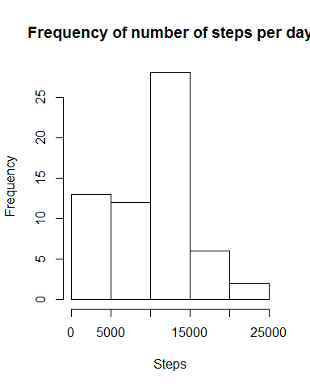
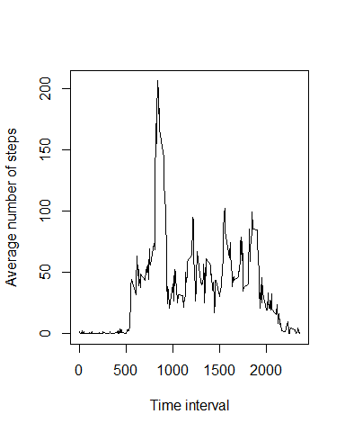
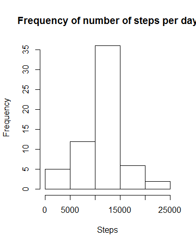
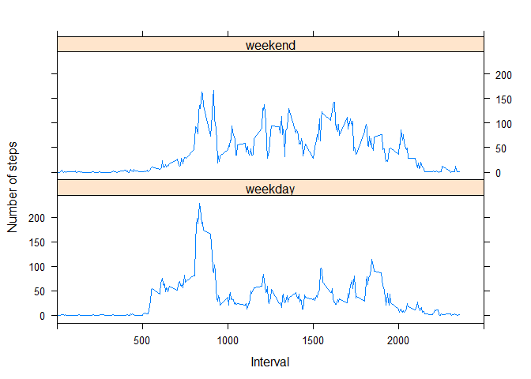

# Reproducible Research: Peer Assessment 1

=================================================


## Loading and preprocessing the data

```r
        require(lattice)
```

```
## Loading required package: lattice
```

```
## Warning: package 'lattice' was built under R version 3.1.3
```

```r
        setwd("G:/Reproducable Research/A1")
        
        Data <- read.csv("activity.csv", colClasses = c("integer", "Date", "integer"), header=TRUE, sep=",")
```
## What is mean total number of steps taken per day?
The total number of steps per day in a histogram:

```r
        Days <- Data[!duplicated(Data[,"date"]),"date"]
        Intervals <- Data[,"interval"][1:288]
        
        S <- data.frame(Steps = integer(length(Days)))
        S[,"Steps"] <- tapply(Data[,"steps"], Data[,"date"], sum, na.rm=TRUE)
        hist(S[,"Steps"], main="Frequency of number of steps per day",
             xlab="Steps")
```

 

```r
        Mean <- format(round(mean(S[,"Steps"], na.rm=TRUE), digits = 1), scientific = FALSE)   
        Median <- format(round(median(S[,"Steps"], na.rm=TRUE), digits = 1), scientific = FALSE)
```

The mean of the total number of steps take per day is 9354.2 and the
median is 10395.

The next plot shows the average number of steps taken per 5 minute interval.

## What is the average daily activity pattern?

```r
        Series <- by(Data[,"steps"], Data[,"interval"], mean, na.rm=TRUE)
        plot(Intervals,Series[], type="l", xlab="Time interval", ylab="Average number of steps")
```

 


```r
        MaxIndex <- which.max(as.double(Series[]))
```

The average number of steps is at its maximum in the 104th 5 minute interval.

```r
        NrNA <- sum(is.na(Data[,"steps"]))
```
## Imputing missing values
The dataset has 2304 NA entries in its 'steps' column. Since these missing values may introduce bias
I have, from here on, replaced the NA values in the original dataset by mean for that 5-minute 
interval. A histogram of this modified dataset is shown below.

```r
        I <- which(is.na(Data[,"steps"]))
        Data[I,"steps"] <- Series[(I %% length(Series[]))+1]

        S <- data.frame(Steps = integer(length(Days)))
        S[,"Steps"] <- tapply(Data[,"steps"], Data[,"date"], sum, na.rm=TRUE)
        hist(S[,"Steps"], main="Frequency of number of steps per day",
             xlab="Steps")
```

 

```r
        MeanM <- format(round(mean(S[,"Steps"], na.rm=TRUE), digits = 1), scientific = FALSE)   
        MedianM <- format(round(median(S[,"Steps"], na.rm=TRUE), digits = 1), scientific = FALSE)
```

Using the modified dataset the mean of the total number of steps take per day is 10766.2 and the
median is 10766.2. Since I have replaced the NA's by their mean for that 5 minute interval the days 
with many NA's will be close to the 'average' day and so mean and median will be closer to each other.
Since NA's are essentially zeroes in most the calculations the estimates of the total daily number of 
steps (mean) will increase. 

## Are there differences in activity patterns between weekdays and weekends?

```r
        Data <- cbind(Data, W = weekdays(Data[,"date"]), stringsAsFactors = FALSE)
        Data[Data$W == "Sunday" | Data$W == "Saturday", "W"] <- "weekend"
        Data[!(Data$W == "weekend"), "W"] <- "weekday"
        Data[,"W"] <- as.factor(Data[,"W"])

        SeriesW <- data.frame(steps = integer(288), W = "weekday", Y = Intervals)
        SeriesN <- data.frame(steps = integer(288), W = "weekend", Y = Intervals)

        SeriesW[,"steps"] <- as.double(by(Data[Data$W == "weekday","steps"], 
                                          Data[Data$W == "weekday","interval"], mean, na.rm=TRUE))
        SeriesN[,"steps"] <- as.double(by(Data[Data$W == "weekend","steps"], 
                                          Data[Data$W == "weekend","interval"], mean, na.rm=TRUE))
        SeriesR<- rbind(SeriesW, SeriesN) 

        xyplot(steps ~ Y|W, data=SeriesR, layout=c(1,2),
               xlim=c(0,2500), type="l", xlab="Interval", ylab="Number of steps")
```

 
